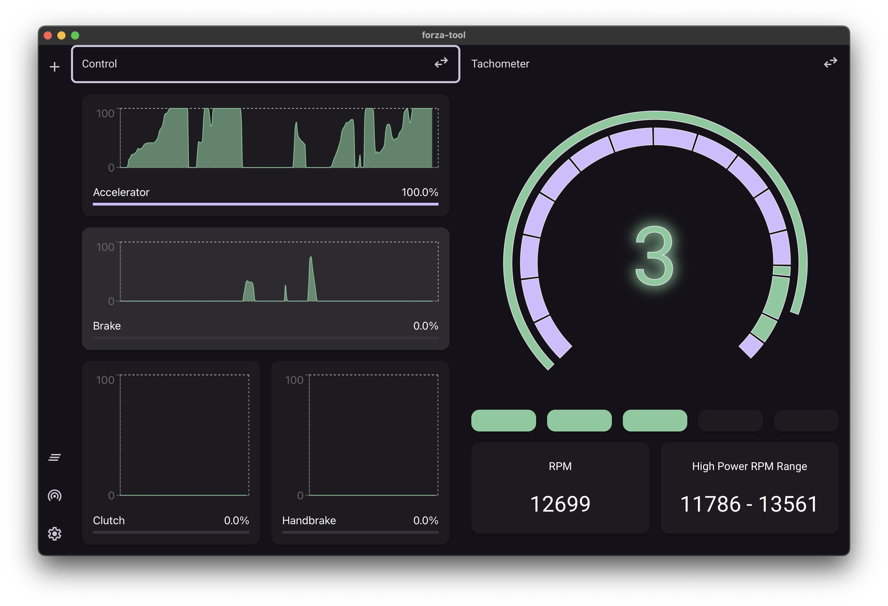

# Forza Tool

A tool for display forza telemetry information.

# Ability

General engine power curve analysis from real time telemetry information.


Reasonable recommendation for engine rpm control.



# Caution

Set your game data out to `Dash`.

When app become weird, you can use the `Clear Cache` button in the `Settings` dialog and restart the app. If it doesn't work, just close the app, go to system app cache directory `C:\Users\${YOUR_USER_NAME}\AppData\Local` and delete the app cache files directory `com.johngu.forze-tool`.

# System requirement

Webview2 support.

# Build

Ensure `node` (with npm) and `rust` is already installed in your computer. And your network is ok for connecting `npmjs.com` and `crates.io`.

```console
# clone project
git https://github.com/JohnGu9/forza-tool.git
cd forza-tool

# build project
npm i
npm run tauri build
```

This project is cross-platform. You can set target-platform to `windows`/`linux`/`macOS` (as long as the platform support `webview2`).
